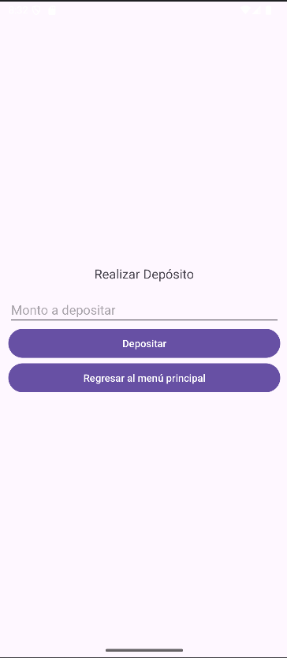

# Aplicación de Banco

Una aplicación móvil para Android desarrollada en Android Studio que permite a los usuarios gestionar cuentas bancarias de manera básica. La app incluye funcionalidades como consultar saldo, realizar depósitos, retiros y transferencias entre cuentas.

## Características principales
- Interfaz sencilla y minimalista.
- Gestión de múltiples usuarios con inicio de sesión y registro.
- Cada usuario tiene un número de cuenta único.
- Funciones principales:
  - **Consultar saldo**: Muestra el saldo actual del usuario.
  - **Realizar depósitos**: Permite ingresar dinero a la cuenta.
  - **Realizar retiros**: Descuenta dinero del saldo de la cuenta.
  - **Transferencias**: Realiza transferencias entre cuentas existentes.
- Validaciones robustas para evitar errores en las operaciones (como evitar números negativos, campos vacíos, etc.).

## Capturas de pantalla

  
  
  
  
  

## Instalación
Puedes descargar el archivo APK desde el siguiente enlace:
[Descargar APK](https://drive.google.com/file/d/1GDi8gmIyRLfr3oys4aRjd3Qq5pbMkhij/view?usp=sharing)

### Detalles Adicionales:
1. **Registro de usuarios:**
   - Los usuarios deben proporcionar información válida: nombre, apellido, usuario y contraseña.
   - Las contraseñas deben coincidir y el saldo inicial no puede ser negativo.

2. **Operaciones bancarias:**
   - **Depósitos:** Solo se aceptan montos mayores a cero.
   - **Retiros:** No se puede retirar más de lo que está disponible en la cuenta.
   - **Transferencias:** El número de cuenta destino debe existir y el monto debe ser válido.

## Contacto
Si tienes dudas o sugerencias, no dudes en contactarme en [barreraha@itecsur.edu.ec](mailto:barreraha@itecsur.edu.ec) o abrir un issue en este repositorio.
